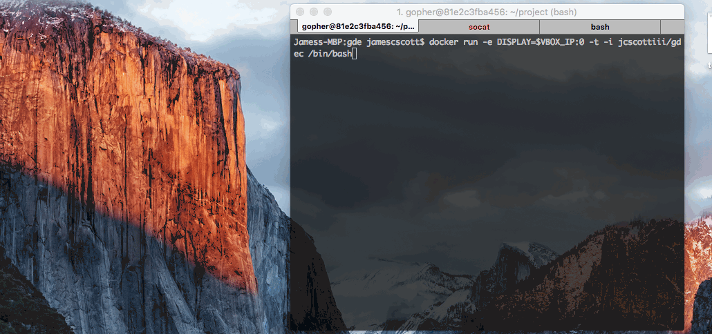
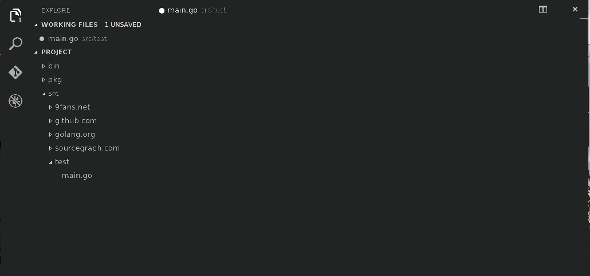
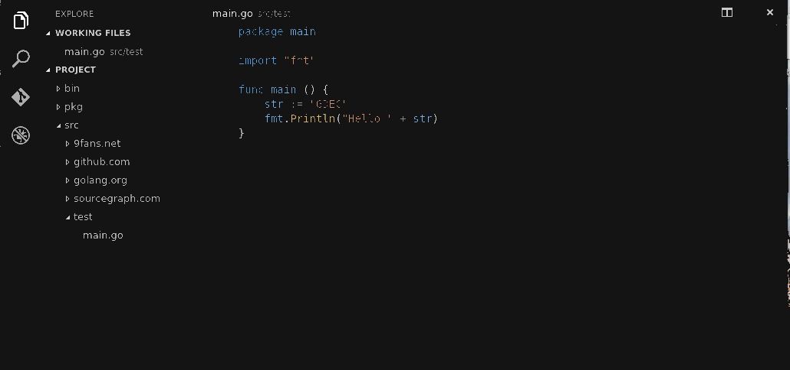

# GDEC
## GDEC [gee-dec] aka Golang Development Environment Container

[](https://hub.docker.com/r/jcscottiii/gdec/)

This Docker image sets up a container with
 - Go v1.5
 - [Visual Studio Code](https://code.visualstudio.com/) with a Golang [Extension] (https://marketplace.visualstudio.com/items/lukehoban.Go) that allows autocomplete, visual debugging and more.
 - A nice user named `gopher`.

For screenshots, checkout the [Screenshots](#screenshots) section below

## Table of Contens
- [Requirements](#requirements)
  - [Installing Requirements](#installing-requirements)
- [Mac OS X Instructions](#mac-os-x-instructions)
  - [Additional Requirements](#additional-requirements-for-mac-os-x)
  - [Running](#running-on-mac-os-x)
  - [Debugging](#debugging-on-mac-os-x)
- [Linux Instructions](#linux-instructions)
- [Windows Instructions](#windows-instructions)
- [Screenshots](#screenshots)
- [Usage] (#usage)
- [TODO](#todo)

## Requirements
- [Docker] (https://www.docker.com/)

### Installing Requirements
 - Docker
   - Mac OS X [Instructions](http://docs.docker.com/mac/step_one/)
   - Linux [Instructions](http://docs.docker.com/linux/step_one/)
   - Windows [Instructions](http://docs.docker.com/windows/step_one/)

## Mac OS X Instructions
### Additional Requirements For Mac OS X
- Socat

  ```
  brew install socat
  ```
  
- XQuartz

  ```
  brew cask install xquartz
  ```

### Running on Mac OS X
- Open two terminals
- In terminal 1:
  - Run
  
    ```
    open -a XQuartz
    socat TCP-LISTEN:6000,reuseaddr,fork UNIX-CLIENT:\"$DISPLAY\"
    ```
    
- In terminal 2:
  - Run
    
    ```
    ifconfig | grep vbox -A 2 # find the "inet" address
    export VBOX_IP=<that inet ip address>
    docker run -e DISPLAY=$VBOX_IP:0 -t -i jcscottiii/gdec /bin/bash
    # Eventually you should be in the container
    code . & # Starts the Visual Studio Code IDE
    ```

### Debugging on Mac OS X

#### When running socat, port 6000 is already taken
- Run
  
    ```
    lsof -i tcp:6000 # to find the PID using port 6000
    kill -9 PID
    ```
    
#### When trying to open Visual Studio Code it fails and in terminal 1, socat is outputting errors (e.g. Invalid arguments)
- Sometimes on your first install of socat, you have restart your Mac. That fixes that usually.

## Linux Instructions
- TODO / Someone else contribute

## Windows Instructions
- TODO / Someone else contribute

## Screenshots
### Visual Studio Code
#### Starting up visual studio code in the container


Follow the running instructions for your OS.

#### Editing Go file in Visual Studio Code


Creating a hello world app

#### Debugging Go file in Visual Studio Code


- Note: The screen capture tool is unable to show the breakpoints being set, but they are. You click to the left of the line numbers.

## Usage
### Using Visual Studio Code
#### Debugger
When you run `code .`, it will start up the IDE at $GOPATH. You will begin to put your source code in $GOPATH/src. The picture above assumes you have package called `test` with a file called `main.go` in the `src` folder (i.e. $GOPATH/src/test/main.go). Press the green play button and a dropdown will appear, select `Go`, it will show `launch.json`. You will want to set the `program` field to `src/test`.

## TODO
- Install other Go IDEs / editors
- Install other Go Tools
- Get instructions for other operating systems
- Talk about exposing ports to demo debugging web services in the container.

## Motivation
I became really excited about Visual Studio Code after seeing the [visual debugger in the Go extension](https://github.com/Microsoft/vscode-go#debugger) for it. However, after thinking about my exisiting Go setups on multiple machines, I imagined the pain of setting it all up multiple times manually.

## Kudos
This would not have been possible without those existing sources on the Internet as this is my first Dockerfile from scratch.
- [Haven Nightly Art](https://haven.nightlyart.com/trying-gui-apps-with-docker/) for tips on running GUI apps on Mac OS X
- This very long [issue](https://github.com/docker/docker/issues/8710) in docker for Mac OS X GUI help
- @jfrazelle's Visual Studio Code [Dockerfile](https://github.com/jfrazelle/dockerfiles/tree/master/visualstudio) for tips on setting VSCode up.
- Project Atomic's [post](http://www.projectatomic.io/docs/docker-image-author-guidance/) on helping set up non-root user.
